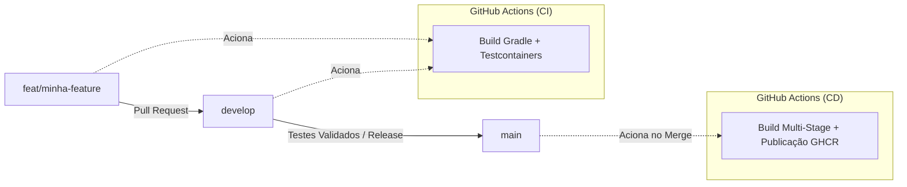

# 🎟️ Projeto Convite - Gestor de Eventos e Convites

[](https://github.com/paulopassos88/projeto-convite/actions/workflows/ci.yml)
[](https://github.com/paulopassos88/projeto-convite/actions/workflows/cd.yml)


MVP de uma API RESTful para gestão de eventos, convidados e confirmações de presença (RSVP), construída com arquitetura moderna e boas práticas de engenharia de software e automação.

---

## 🚀 Tecnologias e Ferramentas

* **Linguagem & Framework:** Java 25, Spring Boot 4.1.0
* **Banco de Dados & Migrations:** PostgreSQL 16, Flyway
* **Segurança & Autenticação:** Spring Security, JWT (jjwt)
* **Mensageria:** Spring Boot AMQP (RabbitMQ)
* **Testes Automatizados:** JUnit 5, Spring Boot Test, **Testcontainers** (PostgreSQL real em contêiner)
* **Containerização:** Docker (Dockerfile Multi-Stage) e Docker Compose
* **CI/CD:** GitHub Actions (Integração Contínua com Testcontainers + Entrega Contínua para GitHub Packages / GHCR)

---

## ⚙️ Pipeline de CI/CD e Estratégia de Branches

O projeto segue um fluxo baseado em **GitFlow simplificado**:



* **Branch `develop`:** Ambiente de integração contínua onde as features são reunidas e validadas.
* **Branch `main`:** Versão estável de produção. Cada merge na `main` dispara automaticamente o pipeline de CD.
* **CI com Testcontainers:** Todos os testes de integração sobem contêineres Docker reais de banco de dados automaticamente no runner do GitHub Actions antes da aprovação do código.

---

## 📦 Como Executar Localmente

### Pré-requisitos
* Java 25 (JDK)
* Docker e Docker Compose

### 1. Clonar o repositório
```bash
git clone https://github.com/paulopassos88/projeto-convite.git
cd projeto-convite
```

### 2. Subir o ambiente com Docker Compose
```bash
docker compose up -d
```

### 3. Rodar os testes de integração localmente
```bash
cd api-convite
./gradlew check
```

---

## 📄 Documentação da API (Swagger / OpenAPI)
Com a aplicação em execução, a documentação interativa pode ser acessada em:
* `http://localhost:8080/api/v1/swagger-ui/index.html` (ou `/swagger-ui.html`)
