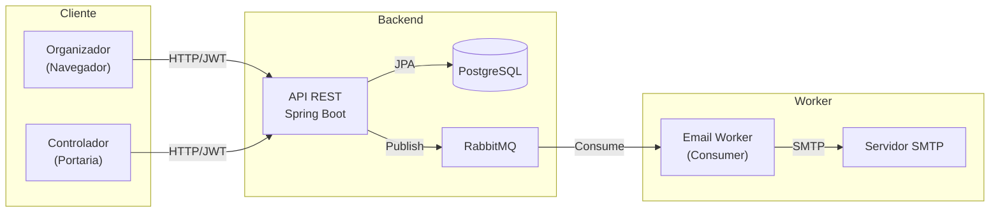
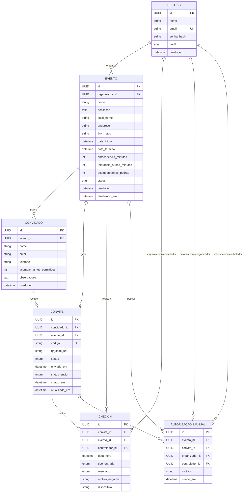
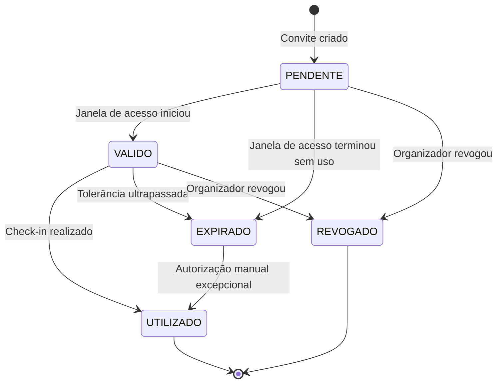
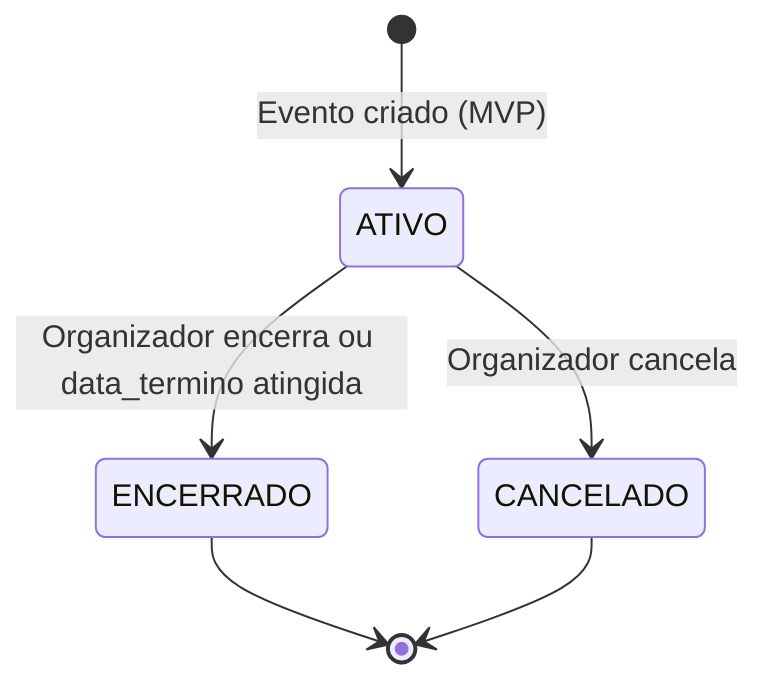
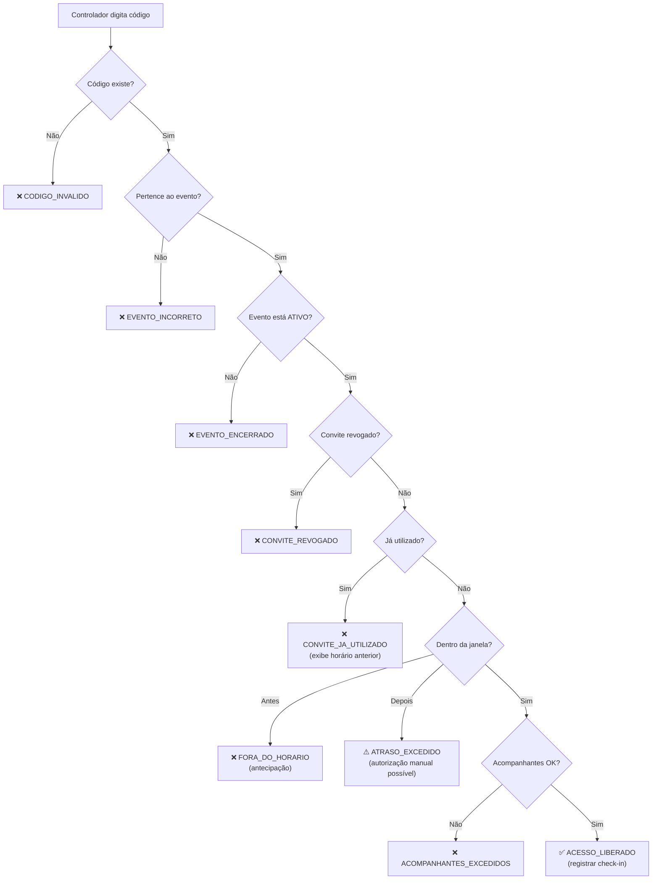

# SPEC.md — Especificação Técnica do MVP

> **Projeto:** Gestor de Eventos & Convites
> **Versão:** 1.0 | **Data:** 13/08/2026 | **Fase:** MVP (Fase 1)
> **Fonte:** [documento-de-requisitos.md](./documento-de-requisitos.md)

---

## 1. Visão Geral e Propósito

O **Gestor de Eventos & Convites** é uma plataforma para organização de listas de presença e controle seguro de acesso a eventos por meio de código único validável.

O sistema permite que organizadores criem eventos, cadastrem convidados, enviem convites com código individual por e-mail e acompanhem entradas em tempo real. Na portaria, controladores de acesso digitam códigos para liberar, negar ou solicitar autorização manual de entradas, conforme regras configuradas pelo organizador.

O convidado é um **usuário passivo** — não cria conta, não faz login. Recebe o convite por e-mail e apresenta o código na portaria.

### 1.1 Os 3 Pilares do Sistema

1. **Convite único e seguro** — cada convidado possui um código válido, rastreável e não reutilizável.
2. **Validação rápida na portaria** — interface simples, resposta imediata e clara para o controlador.
3. **Gestão em tempo real para o organizador** — acompanhamento de entradas, status e exceções com transparência.

### 1.2 Escopo do MVP vs Visão Completa

Este documento cobre exclusivamente o **MVP (Fase 1)**. Funcionalidades de fases futuras estão listadas na [Seção 12](#12-decisões-técnicas-e-simplificações-do-mvp) como referência, mas não serão implementadas agora.

**O MVP cobre:**
- Autenticação e cadastro de usuários (JWT + RBAC)
- CRUD de eventos e convidados (cadastro manual)
- Geração de convites com código único aleatório
- Envio de convites por e-mail (HTML com dados do evento)
- Controle de acesso na portaria (validação por código digitado)
- Regras de horário, tolerância e acompanhantes
- Bloqueio de reutilização e revogação de convites
- Autorização manual pelo organizador
- Dashboard básico com totais e últimos check-ins

**O MVP NÃO cobre:**
- Importação CSV/Excel
- Leitura de QR Code por câmera (MVP usa digitação de código)
- Dashboard com WebSocket (MVP usa polling)
- Reenvio em lote
- Exportação de relatórios
- RSVP, PDF, Google/Apple Wallet, modo offline

---

## 2. Stack Tecnológica

| Camada | Tecnologia | Versão |
|:---|:---|:---|
| **Linguagem** | Java | 25 |
| **Framework** | Spring Boot | 4.1.x |
| **Build** | Gradle | — |
| **Banco de dados** | PostgreSQL | 17+ |
| **Migrações** | Flyway | — |
| **ORM** | Spring Data JPA (Hibernate 6) | — |
| **Segurança** | Spring Security 6 + JWT (jjwt 0.11.5) | — |
| **Hash de senhas** | BCrypt | — |
| **Mensageria** | RabbitMQ (Spring AMQP) | — |
| **Mapeamento** | MapStruct 1.5.5 + Lombok | — |
| **Contêiner** | Docker (multi-stage, Eclipse Temurin 25) | — |
| **Observabilidade** | Spring Boot Actuator (preparado para Prometheus/Grafana) | — |

---

## 3. Arquitetura do Sistema

### 3.1 Diagrama de Componentes



### 3.2 Organização de Pacotes

```
br.com.passos.api_convite/
├── ApiConviteApplication.java
├── infra/                          # Cross-cutting concerns
│   ├── exception/                  # @RestControllerAdvice + ErrorResponse
│   └── security/                   # SecurityConfig, SecurityFilter, TokenService
└── domain/                         # Package-by-feature
    ├── usuario/                    # Autenticação e cadastro
    │   ├── controller/
    │   ├── dto/
    │   ├── mapper/
    │   ├── model/
    │   ├── repository/
    │   └── service/
    ├── evento/                     # Gestão de eventos
    │   ├── controller/
    │   ├── dto/
    │   ├── mapper/
    │   ├── model/
    │   ├── repository/
    │   └── service/
    ├── convidado/                   # Gestão de convidados
    │   ├── controller/
    │   ├── dto/
    │   ├── mapper/
    │   ├── model/
    │   ├── repository/
    │   └── service/
    ├── convite/                    # Geração e envio de convites
    │   ├── controller/
    │   ├── dto/
    │   ├── mapper/
    │   ├── model/
    │   ├── repository/
    │   └── service/
    ├── checkin/                    # Registro de check-in
    │   ├── controller/
    │   ├── dto/
    │   ├── mapper/
    │   ├── model/
    │   ├── repository/
    │   └── service/
    └── portaria/                   # Validação + Autorização manual
        ├── controller/
        ├── dto/
        ├── model/
        ├── repository/
        └── service/
```

### 3.3 Camadas (por feature)

```
Controller → Service → Repository
     ↕           ↕
    DTO       Entity
```

- **Controller:** Recebe requisições, valida DTOs (`@Valid`), delega ao Service, retorna ResponseEntity.
- **Service:** Regras de negócio, orquestração, transações (`@Transactional`).
- **Repository:** Acesso a dados via Spring Data JPA.
- **DTO:** Records Java para entrada e saída. **Nunca** expor `@Entity` no controller.
- **Mapper:** MapStruct para conversão Entity ↔ DTO.

---

## 4. Perfis de Usuário e Controle de Acesso (RBAC)

### 4.1 Perfis do Sistema

| Perfil | Descrição | Tem conta? |
|:---|:---|:---:|
| **ADMIN** | Administrador do sistema. Cadastra organizadores e controladores. | Sim |
| **ORGANIZADOR** | Cria eventos, gerencia convidados, envia convites, visualiza dashboard, autoriza exceções. | Sim |
| **CONTROLADOR** | Valida códigos na portaria, registra entradas, solicita autorização manual. | Sim |
| **Convidado** | Recebe convite por e-mail e apresenta código na portaria. | **Não** |

### 4.2 Matriz de Permissões (MVP)

| Recurso | ADMIN | ORGANIZADOR | CONTROLADOR |
|:---|:---:|:---:|:---:|
| Cadastrar usuários | ✅ | ❌ | ❌ |
| Criar/editar eventos | ❌ | ✅ | ❌ |
| Cancelar/encerrar eventos | ❌ | ✅ | ❌ |
| CRUD de convidados | ❌ | ✅ | ❌ |
| Gerar/reenviar/revogar convites | ❌ | ✅ | ❌ |
| Visualizar dashboard | ❌ | ✅ | ❌ |
| Validar código na portaria | ❌ | ✅ | ✅ |
| Registrar check-in | ❌ | ✅ | ✅ |
| Conceder autorização manual | ❌ | ✅ | ❌ |
| Solicitar autorização manual | ❌ | ❌ | ✅ |

### 4.3 Implementação RBAC

- Roles Spring Security: `ROLE_ADMIN`, `ROLE_ORGANIZADOR`, `ROLE_CONTROLADOR`
- Geradas automaticamente pelo método `Usuario.getAuthorities()` → `"ROLE_" + perfil.name()`
- Autorização URL-based no `SecurityFilterChain` para rotas globais
- Autorização Method-based via `@PreAuthorize` para granularidade nos controllers (`@EnableMethodSecurity` habilitado)

---

## 5. Épicos e Cards do MVP

### Épico 1: Fundação, Autenticação e Modelagem

| Card | Descrição | Status |
|:---|:---|:---:|
| CARD-01 | Modelagem de dados relacional (6 entidades, Flyway V1–V6) | ✅ |
| CARD-02 | Sistema de autenticação JWT + RBAC | A Fazer |

---

### Épico 2: Gestão de Eventos

| Card | Descrição | Requisitos |
|:---|:---|:---|
| CARD-03 | CRUD de Eventos | RF-001, RF-002, RF-004 a RF-010 |
| CARD-04 | Cancelamento e encerramento de eventos | RF-003, RN-014 |

**Regras importantes:**
- Evento é criado diretamente com status `ATIVO` no MVP (sem etapa de rascunho).
- Organizador pode cancelar (`ATIVO` → `CANCELADO`) ou encerrar (`ATIVO` → `ENCERRADO`).
- Evento encerrado/cancelado fica em modo somente leitura — sem novos check-ins.
- Apenas o organizador dono do evento pode editá-lo/cancelá-lo.

---

### Épico 3: Gestão de Convidados

| Card | Descrição | Requisitos |
|:---|:---|:---|
| CARD-05 | CRUD de Convidados (cadastro manual individual) | RF-011, RF-012, RF-013, RF-020 |
| CARD-06 | Validação de duplicidade de e-mail por evento + busca | RF-017, RF-019, RN-012, RN-013 |

**Regras importantes:**
- E-mails duplicados no mesmo evento devem ser bloqueados.
- E-mail deve ter formato válido (Bean Validation `@Email`).
- Busca por nome, e-mail ou código do convite.
- Convidado pode ter quantidade personalizada de acompanhantes (herda `acompanhantes_padrao` do evento se não especificado).

---

### Épico 4: Geração e Envio de Convites

| Card | Descrição | Requisitos |
|:---|:---|:---|
| CARD-07 | Geração de convite com código único aleatório | RF-021 a RF-025, RN-001, RN-015 |
| CARD-08 | Envio de e-mail assíncrono (RabbitMQ) | RF-031 a RF-042, RN-013 |
| CARD-09 | Reenvio individual e revogação de convite | RF-026, RF-028, RF-030, RN-010, RN-011 |

**Regras importantes:**
- Código gerado com UUID + hash (único, não sequencial, não previsível).
- No MVP, o "QR Code" é representado pelo código alfanumérico enviado no e-mail.
- E-mail em template HTML contendo: nome do convidado, nome do evento, data/hora, local, código de acesso.
- Envio via RabbitMQ (publish na API → consume no worker de e-mail).
- Status de envio rastreado: `NAO_ENVIADO`, `ENVIADO`, `FALHA`.
- Revogação invalida o código; reemissão gera novo código mantendo vínculo com o convidado.

---

### Épico 5: Controle de Acesso (Portaria)

| Card | Descrição | Requisitos |
|:---|:---|:---|
| CARD-10 | Endpoint de validação de código | RF-045 a RF-049, RF-053, RN-007 |
| CARD-11 | Regras de janela de acesso + tolerância | RF-048, RN-003, RN-004, RN-005 |
| CARD-12 | Registro de check-in + bloqueio de reutilização | RF-051, RF-052, RF-055, RN-002, RNF-019 |
| CARD-13 | Autorização manual pelo organizador | RF-054, RN-009, RNF-014 |

**Regras importantes:**
- Cadeia de verificação (RN-007): código existe? → evento correto? → não revogado? → não utilizado? → dentro da janela? → acompanhantes OK? → liberar/negar.
- Janela de acesso: `data_inicio - antecedencia_minutos` até `data_inicio + tolerancia_atraso_minutos`.
- Check-in deve ser idempotente ou protegido contra concorrência (RNF-019).
- Toda tentativa (sucesso ou falha) gera registro na tabela `checkin`.
- Autorização manual exige perfil `ORGANIZADOR`, campo `motivo` obrigatório, e gera trilha de auditoria.

---

### Épico 6: Dashboard e Visibilidade

| Card | Descrição | Requisitos |
|:---|:---|:---|
| CARD-14 | Endpoints de métricas, totais e últimos check-ins | RF-057 a RF-062 |

**Escopo do dashboard no MVP:**
- Total de convidados cadastrados
- Total de entradas realizadas (check-ins liberados)
- Total de convites pendentes / utilizados / expirados / revogados
- Taxa de comparecimento (%)
- Lista dos últimos check-ins (nome, horário, tipo de entrada)
- Consulta via endpoint GET com polling (sem WebSocket no MVP)

---

## 6. Modelo de Dados

### 6.1 Diagrama ER



### 6.2 Migrações Flyway (planejadas)

| Migração | Tabela | Status |
|:---|:---|:---:|
| `V1__create_table_usuario.sql` | `usuario` | ✅ |
| `V2__create_table_evento.sql` | `evento` | ✅ |
| `V3__create_table_convidado.sql` | `convidado` | ✅ |
| `V4__create_table_convite.sql` | `convite` | ✅ |
| `V5__create_table_checkin.sql` | `checkin` | ✅ |
| `V6__create_table_autorizacao_manual.sql` | `autorizacao_manual` | ✅ |

### 6.3 Enums

| Enum | Valores |
|:---|:---|
| `Perfil` | `ORGANIZADOR`, `CONTROLADOR`, `ADMIN` |
| `StatusEvento` | `RASCUNHO`, `ATIVO`, `ENCERRADO`, `CANCELADO` |
| `StatusConvite` | `PENDENTE`, `VALIDO`, `EXPIRADO`, `UTILIZADO`, `REVOGADO` |
| `StatusEnvio` | `NAO_ENVIADO`, `ENVIADO`, `FALHA` |
| `TipoEntrada` | `QR_CODE`, `CODIGO_DIGITADO`, `AUTORIZACAO_MANUAL` |
| `ResultadoCheckIn` | `LIBERADO`, `NEGADO`, `AUTORIZADO_MANUALMENTE` |

> **Nota:** O enum `StatusEvento` mantém o valor `RASCUNHO` no banco para compatibilidade futura, mas no MVP o evento é criado diretamente como `ATIVO`.

---

## 7. Contratos de API (Alto Nível)

Os contratos detalhados (request/response JSON) serão especificados conforme cada épico for implementado. Abaixo, a visão geral dos endpoints planejados.

### 7.1 Autenticação

| Método | Endpoint | Descrição | Acesso |
|:---|:---|:---|:---|
| `POST` | `/auth/login` | Autenticar e obter token JWT | Público |

### 7.2 Usuários

| Método | Endpoint | Descrição | Acesso |
|:---|:---|:---|:---|
| `POST` | `/usuarios` | Cadastrar novo usuário | ADMIN |

### 7.3 Eventos

| Método | Endpoint | Descrição | Acesso |
|:---|:---|:---|:---|
| `POST` | `/eventos` | Criar evento | ORGANIZADOR |
| `GET` | `/eventos` | Listar eventos do organizador | ORGANIZADOR |
| `GET` | `/eventos/{id}` | Detalhar evento | ORGANIZADOR, CONTROLADOR |
| `PUT` | `/eventos/{id}` | Editar evento | ORGANIZADOR (dono) |
| `PATCH` | `/eventos/{id}/cancelar` | Cancelar evento | ORGANIZADOR (dono) |
| `PATCH` | `/eventos/{id}/encerrar` | Encerrar evento | ORGANIZADOR (dono) |

### 7.4 Convidados

| Método | Endpoint | Descrição | Acesso |
|:---|:---|:---|:---|
| `POST` | `/eventos/{eventoId}/convidados` | Cadastrar convidado | ORGANIZADOR |
| `GET` | `/eventos/{eventoId}/convidados` | Listar convidados do evento | ORGANIZADOR |
| `GET` | `/eventos/{eventoId}/convidados/{id}` | Detalhar convidado | ORGANIZADOR |
| `PUT` | `/eventos/{eventoId}/convidados/{id}` | Editar convidado | ORGANIZADOR |
| `DELETE` | `/eventos/{eventoId}/convidados/{id}` | Remover convidado | ORGANIZADOR |

### 7.5 Convites

| Método | Endpoint | Descrição | Acesso |
|:---|:---|:---|:---|
| `POST` | `/eventos/{eventoId}/convidados/{convidadoId}/convite` | Gerar convite | ORGANIZADOR |
| `POST` | `/convites/{id}/enviar` | Enviar/reenviar convite por e-mail | ORGANIZADOR |
| `PATCH` | `/convites/{id}/revogar` | Revogar convite | ORGANIZADOR |
| `GET` | `/eventos/{eventoId}/convites` | Listar convites do evento | ORGANIZADOR |

### 7.6 Portaria (Validação + Check-in)

| Método | Endpoint | Descrição | Acesso |
|:---|:---|:---|:---|
| `POST` | `/portaria/validar` | Validar código de acesso | ORGANIZADOR, CONTROLADOR |
| `POST` | `/portaria/autorizacao-manual` | Autorizar entrada manualmente | ORGANIZADOR |

### 7.7 Dashboard

| Método | Endpoint | Descrição | Acesso |
|:---|:---|:---|:---|
| `GET` | `/eventos/{eventoId}/dashboard` | Métricas e totais do evento | ORGANIZADOR |
| `GET` | `/eventos/{eventoId}/dashboard/checkins` | Últimos check-ins realizados | ORGANIZADOR |

### 7.8 Resposta Padrão de Erro

Todas as APIs utilizam o formato padronizado do `GlobalExceptionHandler`:

```json
{
  "status": 400,
  "erro": "Bad Request",
  "mensagem": "Erro de validação nos campos informados.",
  "campos": [
    { "campo": "email", "mensagem": "Formato de e-mail inválido." }
  ],
  "timestamp": "2026-08-13T14:30:00"
}
```

---

## 8. Regras de Negócio do MVP

### RN-001 — Código único por convite
Cada convite possui um código único, não repetido, não sequencial e não previsível. Gerado com UUID + hash criptográfico. Unicidade garantida pela constraint `UNIQUE` na coluna `codigo`.

**Implementa:** CARD-07

### RN-002 — Código não reutilizável
Após o primeiro check-in válido, o convite é marcado como `UTILIZADO`. Apresentações subsequentes são negadas com a mensagem indicando horário da entrada anterior.

**Implementa:** CARD-12

### RN-003 — Janela de acesso
A janela de acesso é o período em que o convite pode ser validado:
- **Início:** `data_inicio - antecedencia_minutos`
- **Fim:** `data_inicio + tolerancia_atraso_minutos`

**Exemplo:** Evento 19:00, Antecedência 30min, Tolerância 30min → Janela: 18:30 a 19:30

**Implementa:** CARD-11

### RN-004 — Antecedência
Convite **não** deve ser aceito antes do início da janela.
- Evento 19:00, Antecedência 30min → Entrada às 18:10 = **Negada** | Entrada às 18:45 = **Válida**

**Implementa:** CARD-11

### RN-005 — Tolerância de atraso
Entradas após o horário de início são permitidas somente até o limite configurado.
- Evento 19:00, Tolerância 30min → Entrada às 19:20 = **Válida** | Entrada às 19:31 = **Expirada**

**Implementa:** CARD-11

### RN-006 — Status do convite
| Status | Descrição |
|:---|:---|
| `PENDENTE` | Convite criado/enviado, ainda não utilizado |
| `VALIDO` | Dentro da janela de acesso, pode ser utilizado |
| `EXPIRADO` | Fora da janela de acesso ou após tolerância |
| `UTILIZADO` | Já validado na portaria |
| `REVOGADO` | Cancelado manualmente pelo organizador |

**Implementa:** CARD-07, CARD-09

### RN-007 — Cadeia de validação na portaria
Ordem obrigatória de verificação:
1. Código existe?
2. Pertence ao evento correto?
3. Não está revogado?
4. Já foi utilizado?
5. Dentro da janela de acesso?
6. Acompanhantes dentro do limite?
7. **Liberar** ou **negar** acesso

**Implementa:** CARD-10

### RN-008 — Acompanhantes
- Convite individual: `acompanhantes_permitidos = 0` → somente o titular
- Convite com acompanhantes: total permitido = 1 (titular) + N (acompanhantes)
- Exemplo: `acompanhantes_permitidos = 2` → máximo 3 pessoas

**Implementa:** CARD-10

### RN-009 — Autorização manual
Em casos excepcionais (erro de leitura, chegada após tolerância, problema técnico), o organizador pode autorizar manualmente. Exige:
- Perfil `ORGANIZADOR`
- Campo `motivo` obrigatório
- Registro de data/hora
- Trilha de auditoria (tabela `autorizacao_manual`)

**Implementa:** CARD-13

### RN-010 — Revogação de convite
Organizador pode revogar a qualquer momento antes do uso. Após revogação: convite não pode mais ser validado, status alterado para `REVOGADO`.

**Implementa:** CARD-09

### RN-013 — E-mail do convidado
Envio depende de e-mail válido. Não enviar se inválido. Registrar tentativa. Permitir reenvio manual. Não criar conta para convidado.

**Implementa:** CARD-08

### RN-014 — Evento encerrado
Após encerramento: novos check-ins bloqueados, dashboard continua disponível para consulta, evento em modo somente leitura.

**Implementa:** CARD-04

### RN-015 — Segurança do código
Código de acesso: único, não sequencial, não previsível, associado a hash/token válido, validado no servidor.

**Implementa:** CARD-07

---

## 9. Máquina de Estados

### 9.1 Convite



> **Nota:** A transição `PENDENTE → VALIDO` e `VALIDO → EXPIRADO` são calculadas em tempo real com base na janela de acesso, não são atualizações persistidas no banco. O status armazenado muda apenas nas transições explícitas: criação (`PENDENTE`), check-in (`UTILIZADO`), revogação (`REVOGADO`).

### 9.2 Evento (MVP)



> **Nota:** No MVP, o evento é criado diretamente como `ATIVO`. O status `RASCUNHO` existe no enum para compatibilidade futura, mas não é utilizado no fluxo atual.

---

## 10. Fluxo de Validação na Portaria

### 10.1 Fluxograma



### 10.2 Tabela de Respostas

| Situação | Resultado | Ação |
|:---|:---|:---|
| Código válido e disponível | `LIBERADO` | Registrar check-in, exibir ✅ |
| Código inexistente | `NEGADO` | Exibir ❌ |
| Convite revogado | `NEGADO` | Exibir ❌ |
| Convite já utilizado | `NEGADO` | Exibir ❌ com horário da entrada anterior |
| Fora da janela (antecipação) | `NEGADO` | Exibir ❌ com horário de abertura |
| Tolerância excedida | `NEGADO` | Exibir ⚠️, permitir autorização manual |
| Evento encerrado/cancelado | `NEGADO` | Exibir ❌ |
| Acompanhantes excedidos | `NEGADO` | Exibir ❌ com limite permitido |

---

## 11. Segurança

### 11.1 Requisitos Não-Funcionais Cobertos

| ID | Requisito | Implementação |
|:---|:---|:---|
| RNF-010 | Senhas com hash seguro | BCrypt via `BCryptPasswordEncoder` |
| RNF-011 | Tokens expiram por inatividade | JWT com expiração de 2 horas |
| RNF-012 | Códigos seguros, validação server-side | UUID + hash, validação no backend |
| RNF-013 | Impedir acesso não autorizado à portaria | JWT obrigatório + `@PreAuthorize` por perfil |
| RNF-014 | Log de autorização manual | Tabela `autorizacao_manual` com motivo obrigatório |
| RNF-015 | Log de tentativas de validação | Toda tentativa gera registro em `checkin` |
| RNF-016 | APIs autenticadas e autorizadas | `SecurityFilterChain` + `@EnableMethodSecurity` |
| RNF-017 | Proteção de dados pessoais | Dados restritos por evento, sem exposição cruzada |

### 11.2 Geração de Código Único

```
código = Base64URL( SHA-256( UUID.randomUUID() + evento_id + convidado_id + timestamp + secret ) )
```

- Não sequencial, não previsível
- Constraint `UNIQUE` na coluna `codigo`
- Validação exclusivamente server-side

### 11.3 Proteção contra Concorrência (Check-in)

O registro de check-in deve ser protegido contra condições de corrida (dois controladores validando o mesmo convite simultaneamente). Estratégia: lock otimista ou `SELECT FOR UPDATE` na transação de check-in.

### 11.4 Trilha de Auditoria

| Ação | Tabela | Campos de rastreio |
|:---|:---|:---|
| Tentativa de validação | `checkin` | `controlador_id`, `data_hora`, `resultado`, `dispositivo` |
| Autorização manual | `autorizacao_manual` | `organizador_id`, `controlador_id`, `motivo`, `criado_em` |

---

## 12. Decisões Técnicas e Simplificações do MVP

| Decisão | Justificativa |
|:---|:---|
| Código alfanumérico em vez de QR Code real | Simplifica o MVP; QR Code é apenas representação visual do código |
| Envio de e-mail assíncrono via RabbitMQ | Desacopla geração do convite do envio; dependência já presente no `build.gradle.kts` |
| E-mail com template HTML | Inclui nome do convidado, evento, data/hora, local e código de acesso |
| Dashboard com polling (GET) | Suficiente para MVP; WebSocket planejado para Fase 2 |
| Sem importação CSV/Excel | Cadastro manual individual cobre o MVP |
| Validação por código digitado (sem câmera) | Funciona em qualquer navegador; leitura de câmera planejada para Fase 2 |
| Evento criado como ATIVO | Sem fluxo de rascunho no MVP; simplifica o ciclo de vida |
| Status VALIDO/EXPIRADO calculado em tempo real | Evita jobs de atualização de status; cálculo baseado na janela de acesso |

---

## 13. Critérios de Aceite do MVP

### 13.1 Autenticação (Épico 1)
- **Dado** que um usuário admin existe, **quando** ele faz `POST /auth/login` com credenciais válidas, **então** o sistema retorna um token JWT válido.
- **Dado** que um token JWT válido existe, **quando** uma requisição é feita com `Authorization: Bearer <token>`, **então** o sistema autentica o usuário.
- **Dado** que um admin está autenticado, **quando** ele faz `POST /usuarios` com dados válidos, **então** o sistema cria o usuário e retorna 201.

### 13.2 Gestão de Eventos (Épico 2)
- **Dado** que um organizador está logado, **quando** cria um evento com dados válidos, **então** o evento é salvo com status `ATIVO` e aparece na lista.
- **Dado** que um organizador é dono do evento, **quando** solicita cancelamento, **então** o status muda para `CANCELADO` e novos check-ins são bloqueados.

### 13.3 Gestão de Convidados (Épico 3)
- **Dado** que um organizador tem um evento ativo, **quando** cadastra um convidado com e-mail válido, **então** o convidado é vinculado ao evento.
- **Dado** que um convidado com mesmo e-mail já existe no evento, **quando** tenta cadastrar novamente, **então** o sistema rejeita com erro 409 (conflito).

### 13.4 Convites (Épico 4)
- **Dado** que um convidado está vinculado a um evento, **quando** o sistema gera o convite, **então** deve gerar código único e armazenar com status `PENDENTE`.
- **Dado** que um convite possui e-mail válido, **quando** o organizador solicita envio, **então** a mensagem é publicada no RabbitMQ e o `status_envio` atualiza para `ENVIADO` ou `FALHA`.
- **Dado** que um convite está ativo, **quando** o organizador revoga, **então** o status muda para `REVOGADO` e o código não pode mais ser validado.

### 13.5 Portaria (Épico 5)
- **Dado** que um convite está válido e não utilizado, **quando** o controlador digita o código, **então** o sistema registra check-in e retorna `LIBERADO`.
- **Dado** que um convite já foi utilizado, **quando** o mesmo código é apresentado, **então** o sistema nega acesso e exibe status `UTILIZADO` com horário anterior.
- **Dado** que a tolerância é de 30 minutos, **quando** um convidado tenta entrar 31 minutos após o início, **então** o sistema retorna `EXPIRADO`.
- **Dado** que um convite permite 2 acompanhantes, **quando** o total solicitado ultrapassa 3 pessoas, **então** o sistema nega por excesso de acompanhantes.
- **Dado** que um organizador autoriza manualmente, **quando** informa o motivo, **então** a entrada é registrada como `AUTORIZADO_MANUALMENTE` com trilha de auditoria.

### 13.6 Dashboard (Épico 6)
- **Dado** que um evento possui check-ins registrados, **quando** o organizador consulta o dashboard, **então** o sistema retorna totais (convidados, entradas, pendentes, taxa de comparecimento) e os últimos check-ins.

---

## 14. Glossário

| Termo | Definição |
|:---|:---|
| **Evento** | Encontro criado pelo organizador, com data, local, regras e convidados |
| **Convidado** | Pessoa convidada para participar do evento |
| **Convite** | Registro individual que vincula um convidado a um evento com código de acesso |
| **Código de Acesso** | Código único alfanumérico gerado para validação do convite |
| **Check-in** | Registro de entrada (ou tentativa) do convidado na portaria |
| **Janela de Acesso** | Período em que o convite pode ser validado (antecedência até tolerância) |
| **Tolerância de Atraso** | Tempo adicional após o início em que entradas ainda são permitidas |
| **Acompanhantes** | Pessoas adicionais permitidas além do titular do convite |
| **Autorização Manual** | Liberação excepcional de entrada pelo organizador, com motivo e auditoria |
| **RBAC** | Role-Based Access Control — controle de acesso baseado em perfis |
| **JWT** | JSON Web Token — token de autenticação stateless |
| **Stateless** | Servidor não guarda estado de sessão; cada requisição se auto-identifica via token |
